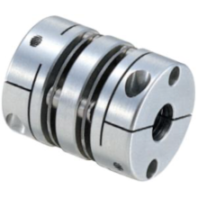

There are several options for leadscrew couplers, listed in order of preference.  This is opinion, feel free to test and evaluate yourself.

#### 1. Joint/spider/plum coupler

These couplers are made of two separate pieces of aluminum and a center plastic joint. They center the leadscrew & stepper better than the solid couplers, and are quiet. Less Z artifacts than either the spring or solid couplers.

#### 2. Rigid coupler

When carefully aligned and straight screws, rigid couplers can produce less Z artifacts than either the spider or spring couplers. However rigid are not included in kits, as they are not recommended unless you are exacting in your alignment. Incorrect alignment will result in worse results than joint/spider/plum couplers.

#### 3. Disc Coupler

These can produce good prints similar to the rigid couplers, but are very expensive and the improvement is not worth the cost.

#### 4. Spring Coupler

These couplers are a common basic coupler. In testing they were louder than the others, and added Z-artifacts / banding.

#### 5. Solid Coupler

These couplers are a very rigid style. Issues are mostly around centering the leadscrew and stepper shaft.  Quieter than a spring style coupler, but can add offset, wobble and some Z artifacts. Not recommended.
